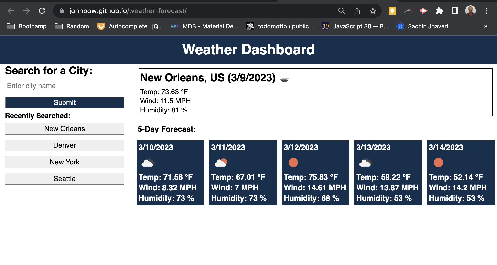

# Weather Dashboard

## Description

This is a weather dashboard which takes advantage of two openweathermap API's. This allows users to not only get the current weather but also the weather 5-days into the future! Users can specific the cities they want to search and the history is kept. They can re-search old terms by clicking on the recently searched buttons.

## Table of Contents

- [Usage](#usage)
- [Credits](#credits)
- [Features](#features)
- [Access](#access)

## Usage

Enter a city name in the upper left box "Enter city name" and click "Submit". This will pull the weather info. You can always search for old cities by clicking the city name buttons below the submit button in "Recently Searched". Enjoy endless days of weather seeking! Improper city names will not show results.

## Credits
This was written from scratch but the API calls were learned in Week 6 content and the JQuery event listeners were learned in Week 5. I used these for help. 

## Features
- Search any city by name to pull up the current weather and 5-day forecast
- See your city search history
- Re-search old cities by clicking on their button, these will not get re-added to the list

## Access

Click to view: [Johnpow's Weather Dashboard](https://johnpow.github.io/weather-forecast/).